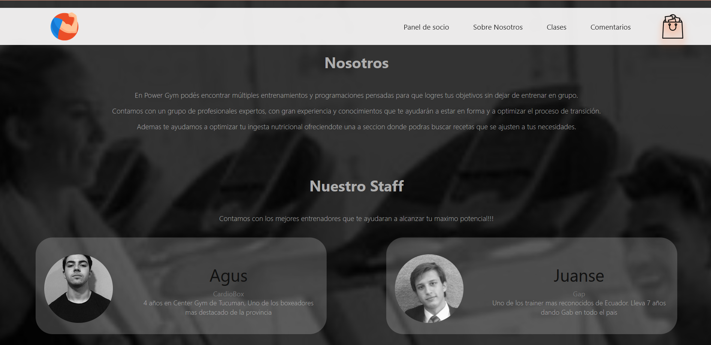
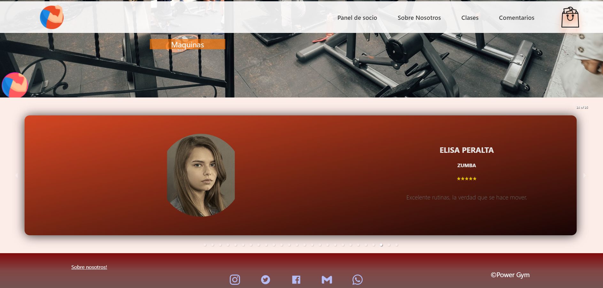
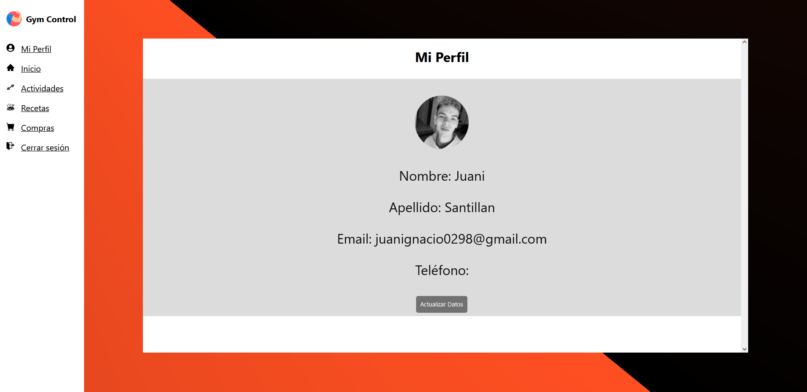
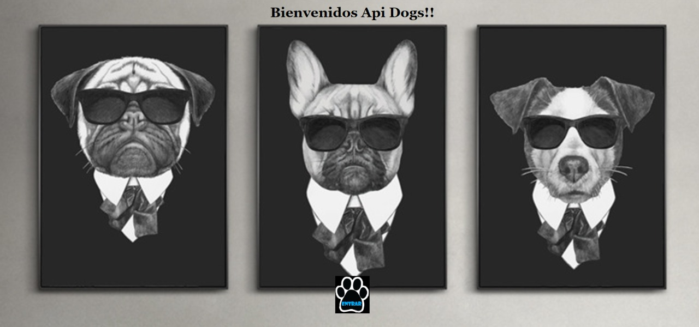
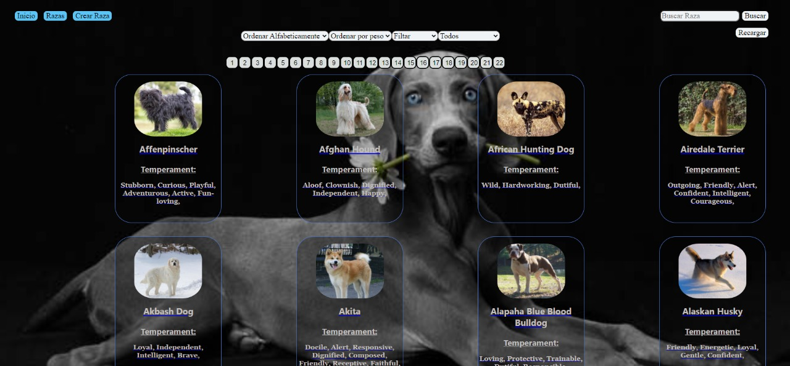
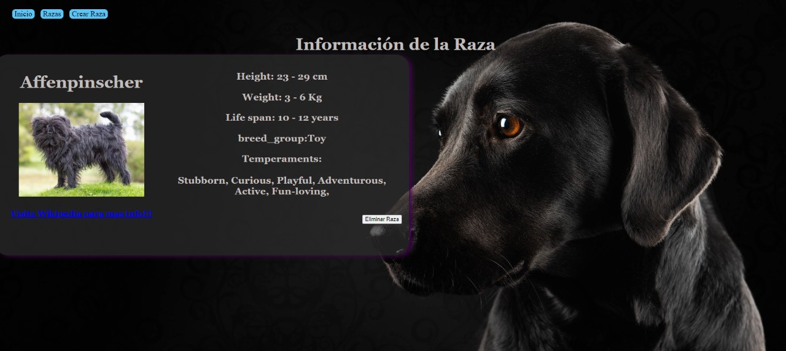
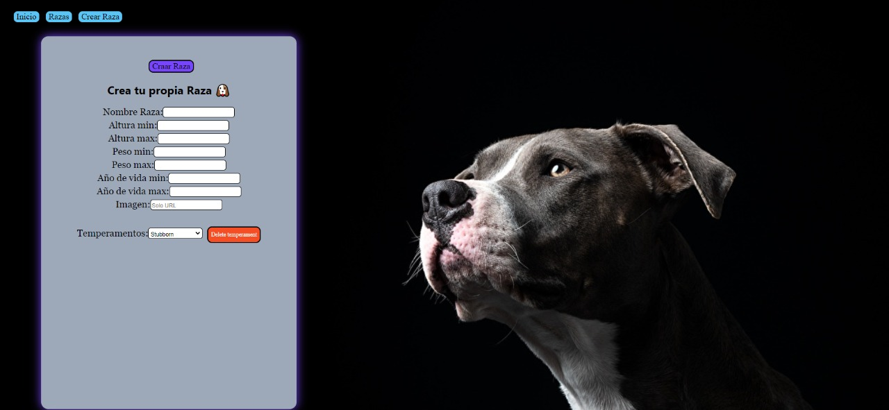
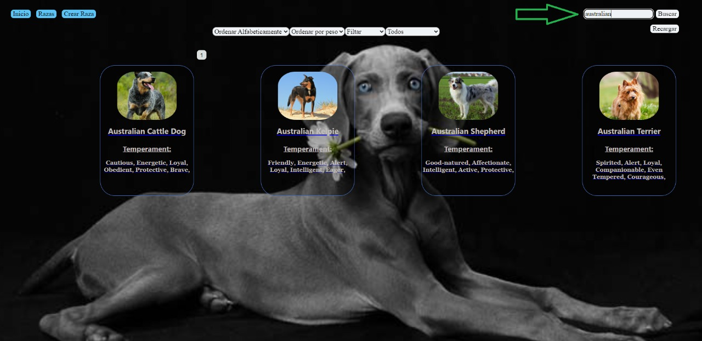
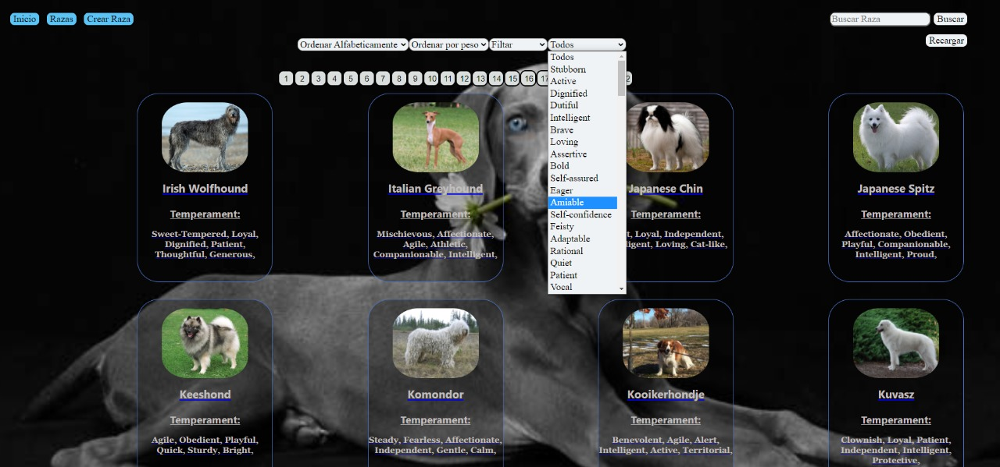

<h1 align="center">Hola 👋, soy Gustavo De Angelis</h1>
<h3 align="center">Full stack web Developer.</h3>

<h3 align="left">Un poco sobre mi:</h3>

 Me considero una persona muy curiosa, siempre con la mentalidad de aprender cosas nuevas, sim importar la edad que tenga. Esta es mi tercera carrera, ya que anteriormente me gradué en "Lic. en Administración de Empresas" y "Licenciatura en Gastronomía".  Ahora que soy un desarrollador de pila completa, busco nuevos desafíos para poder aplicar todas mis habilidades de programación, y seguir aprendiendo de este maravilloso mundo.  Mi jobi es la pesca, la practico en forma habitual compitiendo a nivel provincial y nacional, es mi cable a tierra.  

Podes contactarme en 🌍:
- [Linkedin](https://www.linkedin.com/in/gadeangelis)
- [Gmail](https://mail.google.com/mail/u/0/?tab=rm&ogbl#inbox?compose=jrjtXJSJNrCdLJlhHgHsQqkbWHQnHCbTjKGNKqPkqLrwVPrtwkCzMsmKVXVCtcKbrVKFxVCP)
- [Instagram](https://www.instagram.com/gadeangelis)

<h3 align="left">Languages and Tools:</h3>

                  

&nbsp;

&nbsp;

<h1>📌 Proyectos en los que he trabajado</h1>
<h2 align="center">Power Gym App</h2>

<h4> En este proyecto el objetivo es darle una solución a un gimnasio, la cual le permita gestionar las distintas actividades brindadas por el mismo, generar alta de usuarios y asociarse a las clases disponibles, cobro de cuotas y membresías, sumado a esto brindar además un servicio extra donde se le brinde información al usuario sobre dietas alimenticias específicas para cada caso, algunas funcionalidades son: </h4>

<ul>
<li>Login en la cual el usuario podrá iniciar sesión o registrarse.</li>
<li>Dos roles en la app, administrador y usuario.</li>
<li>Footer con el contacto y las redes sociales del gimnasio. </li>
<li>Nav Bar con las diferentes secciones de la página. </li>
<li>Sección de carrito. </li>
<li>
Sección de dietas alimenticias. </li>
<li>
Sección de actividades del gimnasio con sus respectivos cupos, horarios y capacidad. </li>
<li> Pasarela de pago integrada con Mercado Pago para gestionar los cobros de las clases.</li>
<li>
Sección en donde se incluye la localización de la sucursal del gym seleccionada a través de la API de Google Maps. </li>
<li>Sección de dietas basada en API externa de comida en donde el usuario puede obtener recetas en base a sus necesidades.</li>
<li>Sección de perfil donde se puede visualizar las órdenes del usuario, dejar reviews de las clases adquiridas</li>
</ul>

  
  

  
  

  
  

  
  

  
  

&nbsp;

    <a href="https://github.com/agskbr/PF-Gym-Control-App">Ver Repositorio</a>
    <a>ㅤㅤ</a>
    <a href="https://pgym-henry-final.vercel.app">Ver Deploy Web</a>

Contributors

&nbsp;

<h2 align="center">Dogs App</h2>

<h4>Realice esta app para rendir mi PI (Proyecto Individual). Para la misma habia que utilizar la API ("thedogapi").
 La app permite ordenar, filtrar, ver detalle de cada raza y crear nuevas.
 Realizada con javaScript, nodeJs, react, redux, Sql entre otras mas herramientas.
 Te invito a que veas del deploy y crees tu propia raza 🐶
</h4>
&nbsp;

    
    
    
    
    
    

    <a href="https://github.com/gadeangelis/PI-DOGS">Ver Repositorio</a>
    <a>ㅤㅤ</a>
    <!-- <a href="https://dog-nu.vercel.app">Ver Deploy</a> -->

<!--
**gadeangelis/gadeangelis** is a ✨ _special_ ✨ repository because its `README.md` (this file) appears on your GitHub profile.

Here are some ideas to get you started:

- 🔭 I’m currently working on ...
- 🌱 I’m currently learning ...
- 👯 I’m looking to collaborate on ...
- 🤔 I’m looking for help with ...
- 💬 Ask me about ...
- 📫 How to reach me: ...
- 😄 Pronouns: ...
- ⚡ Fun fact: ...
-->
